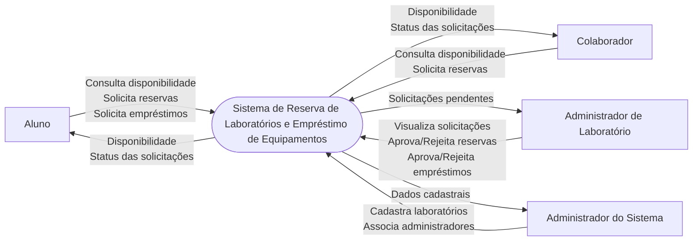
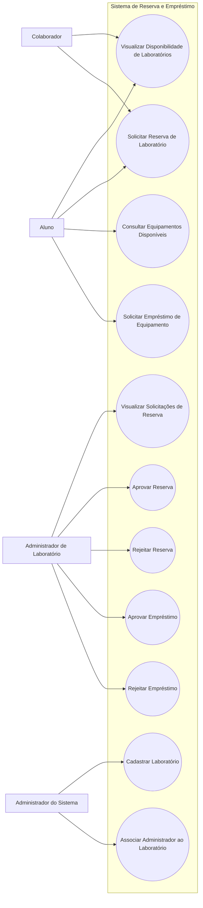
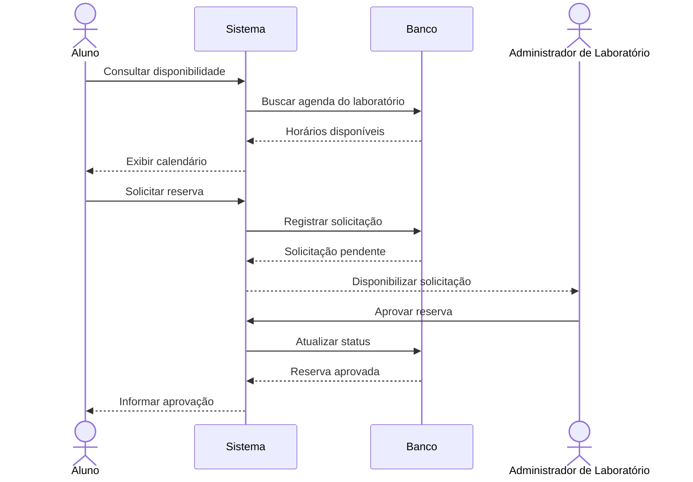
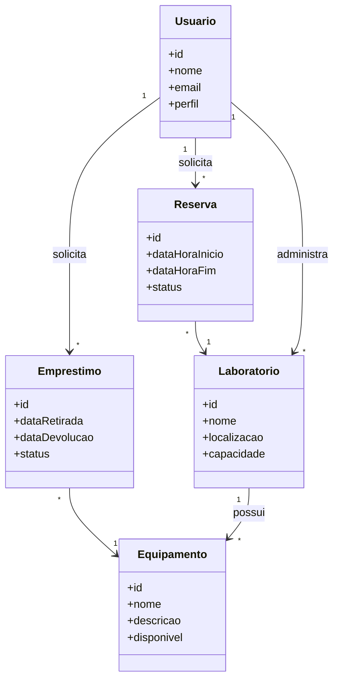

# Diagrama de Contexto:  

```mermaid
flowchart LR

    Aluno[Aluno]
    Colaborador[Colaborador]
    AdmLab[Administrador de Laboratório]
    AdmSis[Administrador do Sistema]

    Sistema([Sistema de Reserva de Laboratórios e Empréstimo de Equipamentos])

    Aluno -->|Consulta disponibilidade\nSolicita reservas\nSolicita empréstimos| Sistema
    Sistema -->|Disponibilidade\nStatus das solicitações| Aluno

    Colaborador -->|Consulta disponibilidade\nSolicita reservas| Sistema
    Sistema -->|Disponibilidade\nStatus das solicitações| Colaborador

    AdmLab -->|Visualiza solicitações\nAprova/Rejeita reservas\nAprova/Rejeita empréstimos| Sistema
    Sistema -->|Solicitações pendentes| AdmLab

    AdmSis -->|Cadastra laboratórios\nAssocia administradores| Sistema
    Sistema -->|Dados cadastrais| AdmSis
```

# Diagrama de Casos de Uso:  

```mermaid
flowchart LR

    Aluno[Aluno]
    Colaborador[Colaborador]
    AdmLab[Administrador de Laboratório]
    AdmSis[Administrador do Sistema]

    subgraph Sistema["Sistema de Reserva e Empréstimo"]

        UC1((Visualizar Disponibilidade de Laboratórios))
        UC2((Solicitar Reserva de Laboratório))
        UC3((Consultar Equipamentos Disponíveis))
        UC4((Solicitar Empréstimo de Equipamento))

        UC5((Visualizar Solicitações de Reserva))
        UC6((Aprovar Reserva))
        UC7((Rejeitar Reserva))

        UC8((Aprovar Empréstimo))
        UC9((Rejeitar Empréstimo))

        UC10((Cadastrar Laboratório))
        UC11((Associar Administrador ao Laboratório))
    end

    Aluno --> UC1
    Aluno --> UC2
    Aluno --> UC3
    Aluno --> UC4

    Colaborador --> UC1
    Colaborador --> UC2

    AdmLab --> UC5
    AdmLab --> UC6
    AdmLab --> UC7
    AdmLab --> UC8
    AdmLab --> UC9

    AdmSis --> UC10
    AdmSis --> UC11
```

# Diagrama de Sequência do fluxo principal:  

```mermaid
sequenceDiagram

    actor Aluno
    participant Sistema
    participant Banco
    actor AdmLab as Administrador de Laboratório

    Aluno->>Sistema: Consultar disponibilidade

    Sistema->>Banco: Buscar agenda do laboratório
    Banco-->>Sistema: Horários disponíveis

    Sistema-->>Aluno: Exibir calendário

    Aluno->>Sistema: Solicitar reserva

    Sistema->>Banco: Registrar solicitação
    Banco-->>Sistema: Solicitação pendente

    Sistema-->>AdmLab: Disponibilizar solicitação

    AdmLab->>Sistema: Aprovar reserva

    Sistema->>Banco: Atualizar status
    Banco-->>Sistema: Reserva aprovada

    Sistema-->>Aluno: Informar aprovação
```

# Diagrama de Classes:  

```mermaid
classDiagram

class Usuario {
    +id
    +nome
    +email
    +perfil
}

class Laboratorio {
    +id
    +nome
    +localizacao
    +capacidade
}

class Equipamento {
    +id
    +nome
    +descricao
    +disponivel
}

class Reserva {
    +id
    +dataHoraInicio
    +dataHoraFim
    +status
}

class Emprestimo {
    +id
    +dataRetirada
    +dataDevolucao
    +status
}

Usuario "1" --> "*" Reserva : solicita

Usuario "1" --> "*" Emprestimo : solicita

Reserva "*" --> "1" Laboratorio

Emprestimo "*" --> "1" Equipamento

Laboratorio "1" --> "*" Equipamento : possui

Usuario "1" --> "*" Laboratorio : administra
```
